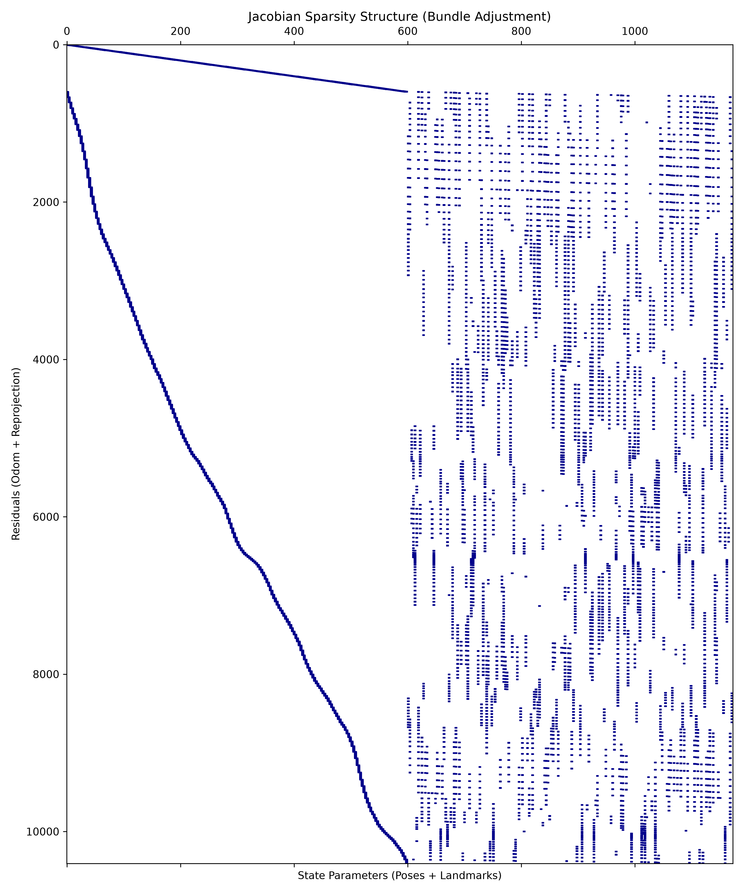
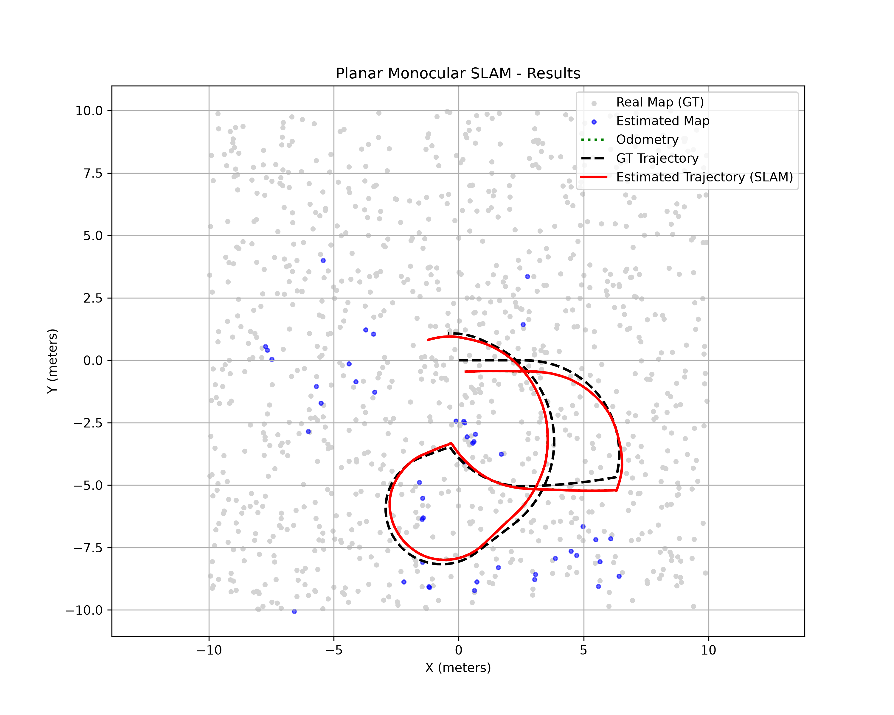

# Planar Monocular SLAM

## Overview

This project implements an educational **Planar Monocular SLAM** pipeline for a **differential-drive mobile robot equipped with a monocular camera**.

The goal of the project is to estimate the robot trajectory and reconstruct a sparse 3D map of the environment by combining:

- noisy wheel odometry;
- monocular image measurements associated with known landmark IDs;
- known camera intrinsic and extrinsic parameters;
- nonlinear optimization through Bundle Adjustment.

Although the robot moves on a planar surface and its pose is represented in SE(2), the visual reconstruction is performed in 3D, since landmark triangulation and camera projection are naturally defined in the three-dimensional space.

The final output of the system consists of:

- an optimized robot trajectory;
- an optimized sparse 3D landmark map;
- quantitative error metrics with respect to the available ground truth;
- a visualization comparing odometry, ground truth and the estimated SLAM result.

---

## Assignment Requirements

The assignment requires the implementation of a Planar Monocular SLAM system with the following inputs and outputs.

### Input

The system receives:

- integrated dead reckoning from wheel odometry;
- a stream of point projections with associated landmark IDs;
- camera parameters:
  - intrinsic matrix K;
  - extrinsic transformation between robot and camera.

### Output

The system must estimate and evaluate:

- the robot trajectory, comparing the estimate with the ground truth;
- the 3D landmark map, comparing the estimate with the ground truth;
- translation and rotation error values.

The implemented solution follows the suggested approach:

1. bootstrap the system by triangulating an initial set of 3D landmarks using the odometry guess;
2. refine both robot poses and landmark positions through Bundle Adjustment formulated as a nonlinear least-squares optimization problem.

---

## Dataset Structure

The code expects a `data/` folder containing the following files:

```text
data/
├── world.dat
├── trajectoy.dat
├── camera.dat
└── meas-XXXX.dat
```

### File Description

- `world.dat`  
  Contains the ground-truth 3D positions of the landmarks.

- `trajectoy.dat`  
  Contains the odometry poses and the ground-truth robot poses.  
  Note: the provided dataset uses the filename `trajectoy.dat`.

- `camera.dat`  
  Contains the camera intrinsic matrix, the rigid transformation from robot to camera, the near/far visibility range and the image resolution.

- `meas-XXXX.dat`  
  Contains the measurements for each frame:
  - frame index;
  - odometry pose;
  - ground-truth pose;
  - observed landmark IDs;
  - corresponding image coordinates.

---

## Project Structure

```text
.
├── main.py
├── data_parser.py
├── frontend.py
├── backend.py
├── evaluation.py
├── geometry_utils.py
├── README.md
├── images/
│   ├── sparsity_pattern.png
│   └── slam_results.png
└── data/
    ├── world.dat
    ├── trajectoy.dat
    ├── camera.dat
    └── meas-XXXX.dat
```

### Source Files

- `main.py`  
  Entry point of the project. It runs the complete pipeline: data loading, bootstrap, Bundle Adjustment, evaluation and plotting.

- `data_parser.py`  
  Parses the dataset files and organizes all the information into a single dictionary used by the rest of the pipeline.

- `frontend.py`  
  Implements the bootstrap phase, including landmark observation collection, best observation pair selection and initial triangulation.

- `backend.py`  
  Implements the Bundle Adjustment backend, including:
  - state vector packing and unpacking;
  - residual computation;
  - odometry constraints;
  - reprojection constraints;
  - sparse Jacobian construction;
  - sparsity pattern image generation;
  - post-optimization landmark filtering.

- `evaluation.py`  
  Computes the evaluation metrics, generates the final visualization and saves the final SLAM result plot.

- `geometry_utils.py`  
  Provides geometric utility functions for:
  - SE(2) to SE(3) conversion;
  - homogeneous transformations;
  - inverse transformations;
  - camera projection matrix computation.

---

## Installation

### Recommended Python Version

```text
Python 3.10+
```

### Required Packages

Install the required dependencies with:

```bash
pip install numpy scipy matplotlib opencv-python
```

---

## Usage

Run the project from the root directory with:

```bash
python main.py
```

The program will:

1. load the dataset;
2. generate the initial triangulated map;
3. run Bundle Adjustment;
4. evaluate the optimized result;
5. save the generated figures;
6. display the final plot.

During execution, the program prints information about:

- number of initial landmarks;
- number of final landmarks;
- translation RMSE;
- rotation RMSE;
- map RMSE;
- mean reprojection error;
- median reprojection error;
- number of observations used after Bundle Adjustment;
- absolute trajectory RMSE after SE(2) alignment.

The program also saves the following images:

```text
sparsity_pattern.png
slam_results.png
```

For the README, these images are placed inside the `images/` folder.

---

## Methodology

The SLAM pipeline is organized into four main stages:

1. data loading;
2. bootstrap through initial triangulation;
3. Bundle Adjustment;
4. evaluation and visualization.

---

## 1. Data Loading

The first stage reads all the dataset files and stores the information in a unified structure.

The loaded data include:

- the ground-truth landmark map;
- the odometry trajectory;
- the ground-truth trajectory;
- the camera intrinsic and extrinsic parameters;
- the image measurements for each frame.

This modular structure makes the following stages easier to implement, debug and evaluate.

---

## 2. Bootstrap Phase: Initial Triangulation

The initial 3D map is generated through a bootstrapping stage.

For each landmark, all available observations across the measurement files are collected. Since monocular triangulation is sensitive to the relative camera displacement between observations, the algorithm does not simply use the first two observations.

Instead, for each landmark, the algorithm selects the pair of observations with the largest camera baseline. This improves the numerical stability of the triangulation.

After selecting the best observation pair, the corresponding landmark is triangulated in 3D.

A landmark is kept only if:

- it has at least two observations;
- the selected camera baseline is large enough;
- the homogeneous triangulation is numerically stable;
- the reconstructed point has positive depth in both camera views;
- the reprojection error on the selected pair is sufficiently small;
- the point is not excessively far from the origin.

This stage produces the initial sparse map, which is then refined during Bundle Adjustment.

---

## 3. Bundle Adjustment

After the bootstrap phase, the system performs a nonlinear least-squares Bundle Adjustment.

The optimized state contains:

- correction terms for all robot poses;
- 3D coordinates of all triangulated landmarks.

The robot poses are represented as corrections with respect to the odometry estimate:

```text
pose_k = odom_k + delta_k
```

where:

- `odom_k` is the odometric pose;
- `delta_k` is the optimized correction term.

This formulation uses odometry as an initial guess and allows the optimizer to refine the trajectory using both motion and visual information.

---

## Cost Function

The Bundle Adjustment cost function contains three families of residuals.

### 1. Prior on the First Pose

A prior is added on the correction of the first pose.

This is necessary to fix the gauge freedom of the optimization and prevent the entire solution from drifting arbitrarily.

### 2. Relative Odometry Constraints

For each pair of consecutive poses, the relative motion estimated from the optimized poses is compared with the relative motion measured by odometry.

This term regularizes the trajectory and helps preserve a physically plausible motion.

### 3. Landmark Reprojection Errors

For each image measurement, the corresponding 3D landmark is projected into the image plane using the current estimate of the camera pose.

The projected pixel is then compared with the measured pixel coordinate.

The reprojection residual is defined as:

```text
e_proj = [u_proj - u_meas, v_proj - v_meas]
```

where:

- `(u_proj, v_proj)` is the projected landmark position;
- `(u_meas, v_meas)` is the measured image point.

---

## Jacobian Sparsity Structure

The Bundle Adjustment problem has a naturally sparse structure.

Each residual depends only on a small subset of the state variables:

- the prior depends only on the first pose;
- each odometry residual depends only on two consecutive poses;
- each reprojection residual depends only on one robot pose and one landmark.

For this reason, the implementation explicitly builds a sparse Jacobian structure and passes it to `scipy.optimize.least_squares`.

This significantly improves computational efficiency compared to a dense optimization approach.

### Sparsity Pattern

The generated sparsity pattern is saved as:

```text
sparsity_pattern.png
```

The figure shows:

- a left block associated with pose-related residuals;
- a sparse right block associated with landmark reprojection dependencies.

This confirms the expected Bundle Adjustment structure: each visual residual affects only one camera pose and one 3D landmark.



---

## 4. Post-Optimization Landmark Filtering

After Bundle Adjustment, the resulting map is filtered again to remove unstable or poorly reconstructed landmarks.

A landmark is preserved only if:

- it is not too far from the origin;
- it has enough valid observations;
- its mean reprojection error is below a fixed threshold.

This final filtering step reduces map density, but improves the reliability and geometric consistency of the final reconstruction.

---

## Evaluation

The optimized trajectory and map are compared against the available ground truth.

The implemented evaluation computes:

- translation RMSE;
- rotation RMSE;
- map RMSE;
- mean reprojection error;
- median reprojection error;
- absolute trajectory RMSE after SE(2) alignment.

---

## Pose Error Evaluation

The translation and rotation errors are computed using relative motions between consecutive poses.

This is consistent with the SLAM formulation because relative motion errors evaluate how well the estimated trajectory preserves the local motion structure.

For each pair of consecutive poses, the relative transformation of the estimated trajectory is compared with the relative transformation of the ground-truth trajectory.

The final errors are reported as:

- translation RMSE in meters;
- rotation RMSE in radians.

---

## Map Error Evaluation

The map error is computed by comparing each estimated landmark with the corresponding ground-truth landmark, when the same landmark ID is available.

The final map error is reported as a 3D RMSE.

---

## Reprojection Error Evaluation

The reprojection error measures how well the optimized landmarks and poses explain the original image measurements.

For each valid observation:

1. the estimated 3D landmark is projected into the image;
2. the projected pixel is compared with the measured pixel;
3. the Euclidean pixel error is accumulated.

The final report includes:

- mean reprojection error;
- median reprojection error;
- number of valid observations used after optimization.

---

## SE(2) Alignment for Visualization and Absolute Trajectory RMSE

For visualization and absolute trajectory evaluation, the estimated trajectory is aligned to the ground truth through a planar rigid transformation.

The alignment compensates for possible residual global offsets between the estimated and ground-truth trajectories.

The same SE(2) alignment is also applied to the landmark map for visualization purposes.

This allows a clearer comparison between:

- raw odometry;
- ground-truth trajectory;
- optimized SLAM trajectory;
- ground-truth landmarks;
- estimated landmarks.

---

## Results

The final visualization compares:

- the ground-truth map;
- the estimated landmark map;
- the raw odometry trajectory;
- the ground-truth trajectory;
- the estimated SLAM trajectory.

The final result plot is saved as:

```text
slam_results.png
```



### Quantitative Results

The program prints the quantitative results at runtime.

The following values were obtained from the final execution of the complete pipeline on the provided dataset:

| Metric | Value |
|---|---:|
| Initial landmarks | 191 |
| Final landmarks | 46 |
| Translation RMSE | 0.0167 m |
| Rotation RMSE | 0.0153 rad |
| Map RMSE | 1.6377 m |
| Mean reprojection error after BA | 10.617 px |
| Median reprojection error after BA | 8.282 px |
| Observations used after BA | 1124 |
| Absolute trajectory RMSE after SE(2) alignment | 0.4697 m |

---


## Discussion of the Results

The results show that the Bundle Adjustment stage improves the trajectory estimate with respect to raw odometry.

The odometry provides a noisy but useful initial guess. Bundle Adjustment then refines this estimate by combining odometry constraints with visual reprojection constraints.

The final trajectory is smoother and more consistent with the ground truth, while the final landmark map is sparse but geometrically meaningful.

The number of retained landmarks may be lower than the number of initially triangulated landmarks. This is expected because the pipeline applies conservative filtering before and after optimization.

This behavior represents a trade-off between:

- map density;
- map reliability;
- reprojection consistency;
- numerical stability.

The map RMSE can remain larger than the pose RMSE because monocular triangulation is especially sensitive to:

- baseline quality;
- image noise;
- limited visibility;
- geometric degeneracies;
- inaccurate initial depth estimation.

Overall, the implemented system successfully performs the complete Planar Monocular SLAM pipeline required by the assignment.

---

## Challenges Encountered and Solutions

### 1. Instability in the Initial Triangulation

One of the main challenges was the quality of the initial 3D map.

Triangulating landmarks from observations with a small camera baseline produced unstable depth estimates and noisy 3D points.

#### Solution

A best-pair selection strategy was implemented.

For each landmark, the algorithm searches all available observation pairs and selects the pair with the maximum camera baseline.

Additional filters were introduced to reject landmarks with:

- insufficient baseline;
- invalid homogeneous coordinates;
- negative depth;
- excessive distance from the origin;
- high reprojection error.

---

### 2. Trajectory Jitter During Optimization

During development, the estimated trajectory could become unstable or show a zig-zag behavior.

This happened when visual reprojection residuals dominated the optimization too strongly, causing the poses to overfit noisy image measurements.

#### Solution

The balance between odometry residuals and reprojection residuals was tuned.

The odometry constraints act as a regularizer and help preserve smooth and physically plausible motion.

---

### 3. Outlier Landmarks

Some landmarks remained geometrically inconsistent even after the initial bootstrap phase.

These landmarks could negatively affect the quality of the final map and the reprojection error.

#### Solution

A two-stage filtering strategy was adopted:

1. an initial filter during triangulation;
2. a post-optimization filter after Bundle Adjustment.

The final filter keeps only landmarks with enough valid observations and bounded mean reprojection error.

---

### 4. Computational Cost of Bundle Adjustment

Bundle Adjustment can become computationally expensive because the state vector contains both pose parameters and landmark parameters.

A dense Jacobian representation would be inefficient.

#### Solution

The sparsity pattern of the Jacobian was explicitly constructed.

This informs the optimizer about which residuals depend on which variables, reducing unnecessary computations and improving the runtime of the optimization.

---

### 5. Comparison with Ground Truth

Direct absolute comparison between the estimated trajectory and the ground truth can be affected by residual planar offsets.

#### Solution

The main pose evaluation is based on relative motion errors between consecutive poses.

For visualization and absolute trajectory RMSE, an SE(2) alignment is computed between the estimated trajectory and the ground truth.

---

## Limitations

The current implementation has some limitations:

- landmark IDs are assumed to be known;
- feature extraction and data association are not implemented;
- loop closure is not included;
- the system uses all poses rather than a keyframe-based strategy;
- robust loss functions are not used in the final optimization;
- the thresholds used for filtering are manually selected.

---

## Possible Future Improvements

Possible extensions of the project include:

- using robust loss functions in Bundle Adjustment;
- adaptive reprojection thresholds;
- improved landmark initialization;
- keyframe selection;
- automatic outlier rejection before optimization;
- feature extraction and matching instead of known landmark IDs;
- loop closure detection;
- pose graph optimization;
- incremental Bundle Adjustment.

---

## Conclusion

This project implements a complete Planar Monocular SLAM pipeline for a differential-drive robot equipped with a monocular camera.

The system starts from noisy odometry and image measurements, initializes a sparse 3D map through triangulation, and refines both robot poses and landmarks through Bundle Adjustment.

The final evaluation compares the optimized trajectory and map against the available ground truth using geometric and reprojection error metrics.

Despite its simplifying assumptions, the implementation demonstrates the main components of a visual SLAM system:

- initialization;
- geometric projection;
- nonlinear optimization;
- sparsity exploitation;
- map filtering;
- quantitative evaluation.

The final result is a sparse but reliable reconstruction of the environment and an improved estimate of the robot trajectory.